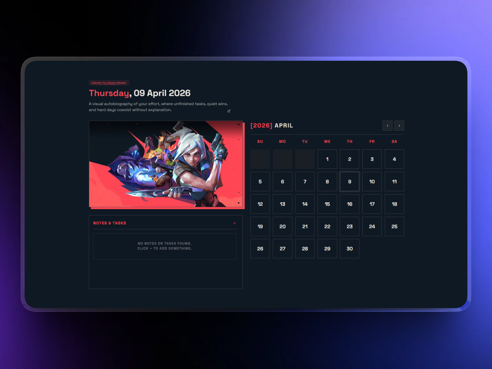

# Valorant-Themed Interactive Calendar

A highly interactive, responsive wall calendar component built with Next.js. It features a sleek, game-inspired aesthetic (Valorant) combined with powerful drag-and-drop task management capabilities functionality.

## 🔗 Links

- **Live Demo:** [Insert Deployed Link Here](https://calendly.harshitparmar.in)
- **GitHub Repository:** [Insert Repository Link Here](https://github.com/harxhitbuilds/calendly-takeUforward)

## ✨ Features

- **Dynamic Drag-and-Drop**: Built using `@dnd-kit/core`, easily create tasks and drag them directly onto calendar dates or reorder them in the notes section.
- **Date Range Selection**: Click and select date ranges to automatically filter your tasks or assign new tasks to a span of days.
- **Valorant Aesthetics**: Sharp edges, bold typography, specific accent colors (red, darks, and lights), and sleek animations using `framer-motion`.
- **Local Persistence**: Tasks and settings are automatically saved to `localStorage`, keeping your data safe across page reloads.
- **Responsive Layout**: Seamlessly adapts from desktop (side-by-side view) to mobile (stacked view).
- **Settings & Customization**: Features an integrated dialog to toggle themes and motivation lines.

## 🛠️ Technologies Used

- **Framework**: Next.js (React)
- **Styling**: Tailwind CSS
- **Interactivity**: `@dnd-kit/core`, `@dnd-kit/sortable`
- **Animations**: `framer-motion`
- **Icons**: Tabler Icons

## 🚀 Getting Started

First, install the dependencies and run the development server:

```bash
npm install
npm run dev
# or yarn / pnpm dev
```

Open [http://localhost:3000](http://localhost:3000) with your browser to see the result. You can start editing the page by modifying `app/page.tsx`.

## 📁 Component Structure

- `calender.tsx` - Main orchestrator managing the state, drag-and-drop context, and layout.
- `calender-components/droppable-day.tsx` - The individual calendar day cells that act as drop targets.
- `calender-components/task-item.tsx` - The sortable and draggable task elements.
- `calender-components/types.ts` - Shared types and local utility functions.
